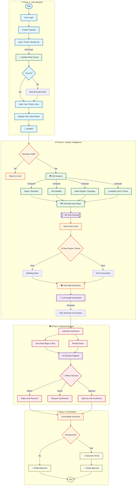

# 🧩 PROCESS FLOWCHART

This diagram visualizes the **Geo-Spatial Risk–Based Building Approval System (Nilgiris)** process.

```mermaid
graph TD
    %% Styling
    classDef user fill:#e1f5fe,stroke:#01579b,stroke-width:2px;
    classDef system fill:#fff3e0,stroke:#e65100,stroke-width:2px;
    classDef gis fill:#e8f5e9,stroke:#1b5e20,stroke-width:2px;
    classDef ml fill:#f3e5f5,stroke:#4a148c,stroke-width:2px;
    classDef auth fill:#ffebee,stroke:#b71c1c,stroke-width:2px;
    classDef final fill:#f9fbe7,stroke:#827717,stroke-width:2px;

    %% PHASE 1: USER
    subgraph Phase1_User [👤 Phase 1: User Request]
        Start([Start]) --> Login[User Login]
        Login --> CreateProp[Create Proposal]
        CreateProp --> InputLand[input: TS No / Survey No]
        InputLand --> |GIS Fetch| ShowParcel[📍 System Plots Parcel]
        ShowParcel --> UserConfirm{Correct?}
        UserConfirm -- No --> AssistDraw[Manual Assist Draw]
        UserConfirm -- Yes --> SubmitDetails[Input: Use, Floors, Area]
        AssistDraw --> SubmitDetails
        SubmitDetails --> UploadDocs[Upload: Plan, Site Photos]
        UploadDocs --> SubmitFinal[🚀 SUBMIT]
    end

    %% PHASE 2: SYSTEM INTELLIGENCE
    subgraph Phase2_System [⚙️ Phase 2: System Intelligence]
        SubmitFinal --> GeoVal{Geometry Valid?}
        GeoVal -- No --> ReturnUser[Return to User]
        GeoVal -- Yes --> GIS_Analysis[🌍 GIS Analysis]
        
        GIS_Analysis --> |Compute| Slope[Slope / Elevation]
        GIS_Analysis --> |Compute| Soil[Soil Stability]
        GIS_Analysis --> |Compute| Water[Water Bodies / Drainage]
        GIS_Analysis --> |Compute| Hazard[Landslide Zone / Forest]

        Slope & Soil & Water & Hazard --> Heatmap[🗺️ Generate Heat Maps]
        Heatmap --> RiskModel[[🧠 ML Risk Scoring]]
        
        RiskModel --> RiskScore[Risk Score 0-100]
        RiskScore --> RuleEngine{⚖️ Rule Engine Checks}
        
        RuleEngine --> |Eval| BuildingRules[Building Rules]
        RuleEngine --> |Eval| HillConservation[Hill Conservation]
        
        BuildingRules & HillConservation --> AuthMap[🏛️ Auto-Map Authorities]
        
        AuthMap --> LLM_Insight[🤖 LLM Insight Generation]
        LLM_Insight --> |Generate| Explanations[Risk Summary for Humans]
    end

    %% PHASE 3: AUTHORITY
    subgraph Phase3_Authority [🏛️ Phase 3: Authority Review]
        Explanations --> AuthDashboard[Authority Dashboard]
        
        AuthDashboard --> ViewMaps[View Heat Maps & Risk]
        AuthDashboard --> ReviewDocs[Review Plans]
        
        ViewMaps & ReviewDocs --> DecisionSupport[AI Decision Support]
        DecisionSupport --> HumanDecision{👮 Officer Decision}
        
        HumanDecision -- Reject --> RejectFlow[Reject with Reasons]
        HumanDecision -- Query --> Clarify[Request Clarification]
        HumanDecision -- Approve --> ApproveFlow[Approve with Conditions]
    end

    %% PHASE 4: FINALIZATION
    subgraph Phase4_Final [📢 Phase 4: Finalization]
        RejectFlow --> Consolidate[Consolidate Decisions]
        ApproveFlow --> Consolidate
        
        Consolidate --> FinalCheck{All Approved?}
        FinalCheck -- No --> NotifyReject[📩 Notify Rejection]
        FinalCheck -- Yes --> GenPermit[📜 Generate Permit]
        GenPermit --> NotifyUsers[📩 Notify Approval]
        NotifyReject --> End([End])
        NotifyUsers --> End
    end

    %% Applying Classes
    class Start,Login,CreateProp,InputLand,UserConfirm,SubmitDetails,UploadDocs,SubmitFinal user;
    class GeoVal,RiskScore,RuleEngine,AuthMap,Consolidate,FinalCheck,ReturnUser system;
    class ShowParcel,IncludeGIS,GIS_Analysis,Slope,Soil,Water,Hazard,Heatmap gis;
    class RiskModel,LLM_Insight,DecisionSupport ml;
    class AuthDashboard,ViewMaps,ReviewDocs,HumanDecision,RejectFlow,ApproveFlow,Clarify auth;
    class GenPermit,NotifyUsers,NotifyReject,End final;

```
